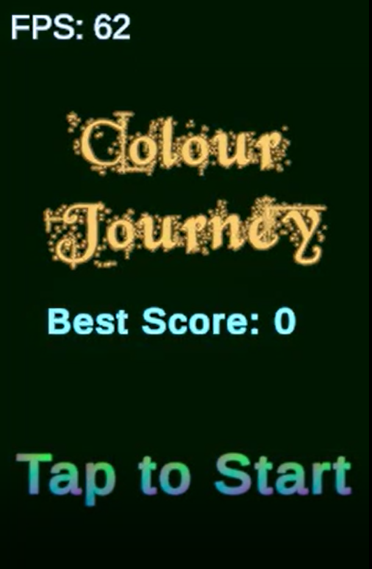
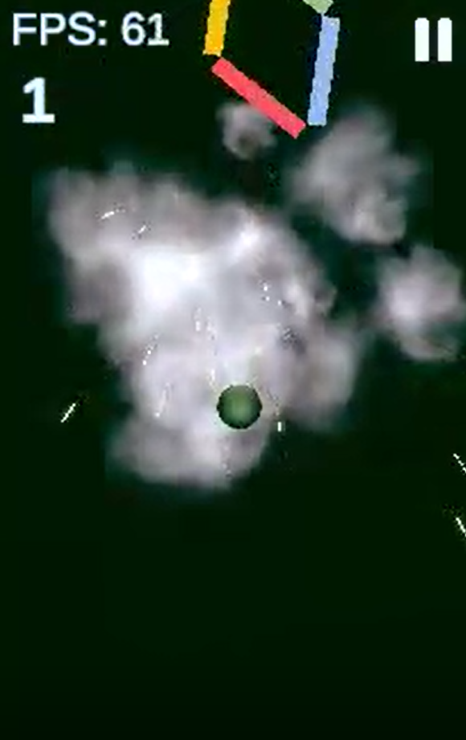
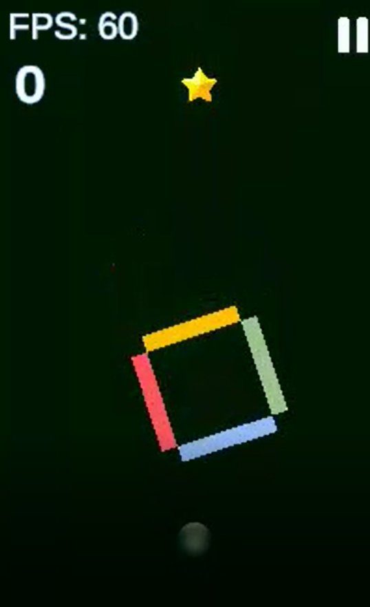
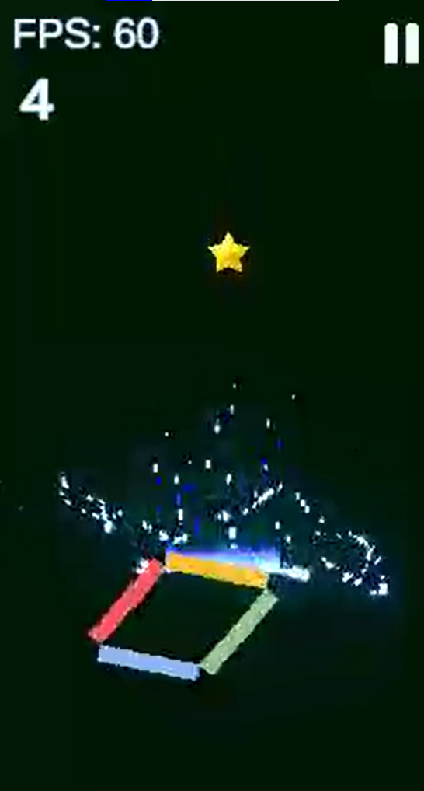
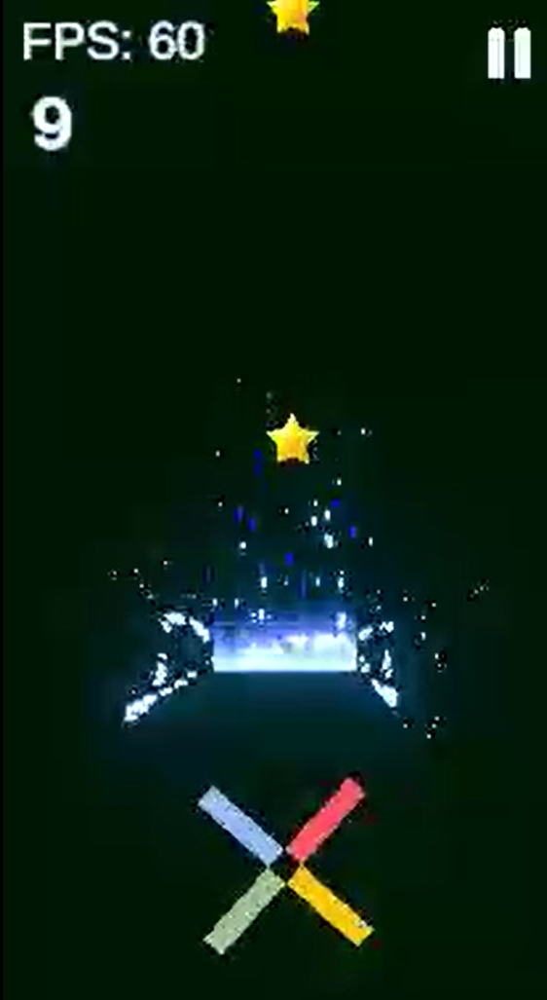

# 🎨 Colour Journey 2D

A high-speed color-based arcade experience where precision timing, pattern recognition, and adaptive difficulty create an endless survival loop.

Built in Unity with a focus on scalable architecture, responsive gameplay systems, and performance-optimized mobile execution.

---

## 🎮 Core Gameplay Loop

- Tap to control vertical movement (jump physics-based)
- Navigate through color-coded obstacles
- Match ball color with valid collision segments
- Survive in an infinite procedural environment
- Collect score-based pickups for progression

---

## 🧠 Core Gameplay Systems

### 🎨 Color Logic System

- Dynamic runtime color switching
- Multi-segment obstacle color composition
- Collision validation based on state matching
- Deterministic failure conditions

### ⚡ Scoring & Progression System

- Additive score model with event-driven updates
- Streak-based multiplier system
- Risk-reward scoring for obstacle traversal
- Persistent high-score tracking

### 🔁 Procedural Endless System

- Infinite obstacle generation loop
- Weighted spawn probability distribution
- Difficulty scaling over time
- Controlled pacing via interpolation curves

---

## ⚙️ Engineering & Architecture

### 🧩 System Design

- Decoupled gameplay systems (controller / logic separation)
- Event-driven collision and state updates
- Modular and reusable gameplay components

### 🧠 Object Lifecycle Management

- Object Pooling architecture for runtime efficiency
- No per-frame instantiation overhead
- Recycled obstacle and collectible entities

### 📈 Difficulty Scaling Model

- Continuous interpolation-based speed increase
- Score-driven dynamic difficulty adjustment
- Controlled curve progression for fair gameplay

---

## 🚀 Performance Considerations

- Mobile-first optimization strategy
- Reduced GC allocation via pooling
- Lightweight physics interactions
- Stable frame pacing under load

---

## 🛠️ Tech Stack

- **Engine:** Unity (2D)
- **Language:** C#
- **Architecture:** OOP + Modular + Event-driven design
- **Target Platform:** Android (Mobile)

---

## 📸 Screenshots

  
  
  

  
  

---

## 📌 Design Goals

This project was designed to explore:

- Responsive arcade-style game feel
- Scalable system architecture in Unity
- Real-time difficulty balancing
- Efficient runtime object management
- Mobile performance constraints

---

## 🚀 Status

✔ Core gameplay loop complete  
✔ Performance systems implemented  
✔ Mobile build optimized  
⏳ Ongoing polish and content expansion
